<div align="center">
        <h3><code>Ved@github ~ $ ./contributions.sh</code></h3>
        
        <br><br>
        <h3><code>Ved@github ~ $ whoami</code></h3>
        <table>
          <tr>
            <td valign="top"></td>
            <td valign="top"></td>
          </tr>
        </table>
</div>
### I build AI systems that actually ship.
**Multi-Agent Pipelines · LLM Engineering · Geospatial AI · Research**

[](https://protfolio-chi-two.vercel.app/)
[](https://linkedin.com/in/ved-vivek-talmaley-ba51a328b)
[](mailto:vedwork21@gmail.com)
[](https://orcid.org/0009-0006-6444-9446)
</br>

[](https://leetcode.com/u/ved_talmaley/)
</div>


---

  
## ⚡ Who Am I

Third-year **B.Tech CS @ SRM Institute of Science and Technology** (CGPA: 8.33/10).

I don't just implement papers — I design systems from scratch. My work spans multimodal vision-language models trained on satellite imagery, 7-agent legal AI pipelines deployed in production at a national hackathon, LLM hallucination evaluation frameworks, and financial intelligence platforms built on production-grade ETL pipelines.

**What I'm doing right now:**
- 🏦 QuantumLens — HSBC financial intelligence platform: dictionary-based KPI extractor, Supabase warehouse, RAG pipeline over earnings data
- 📄 EAI CloudComp 2026 — first-author paper submitted (TerraSight)
- ⚖️ Patent pending — co-inventor on TerraSight environmental analytics system
- 🏆 Deloitte Hacksplosion 2026 — Top 60 / 22,000+ teams nationally (Team Lead)

---

## 🚀 Featured Projects

### 🌍 [TerraSight — Multimodal Geospatial AI](https://github.com/VED-VIVEK-TALMALEY/TerraSight)
> *Ask satellite imagery questions in plain English. Get domain-aware answers.*

**The Problem:** ISRO's open-source GPT models had no multimodal vision capability for Earth Observation data. Standard ViTs can't handle multispectral input (13 bands). GPT-2 can't interpret SAR imagery.

**Why This Stack:**
| Choice | Why |
|---|---|
| SpectralViT (custom) | Standard ViT patch embeddings assume RGB. EO data has 13+ bands with non-uniform spectral relationships — needed band-aware cross-attention from scratch |
| GPT-2 + LoRA (not GPT-4) | Controllable fine-tuning on domain-specific EO instruction data. LoRA keeps trainable params < 1% of total — runnable on academic hardware |
| FastAPI + Express.js dual backend | ML inference (Python) and API orchestration (Node.js) are different performance profiles. Separation lets them scale independently |
| MapLibre GL (not Google Maps) | Open-source, supports 3D terrain, and polygon-draw capability is first-class — critical for the area-selection research workflow |

**Architecture:**
```
Multispectral Input (13 bands, 512×512)
        ↓
  Spectral Attention + Patch Embedding   ← band-aware, not RGB-assumed
        ↓
  SpectralViT Encoder                    ← vision transformer with spectral adapters
        ↓
  Projection Layer                       ← maps vision → language space
        ↓
  GPT-2 + LoRA Adapters                  ← PEFT fine-tuned, ~1% params trained
        ↓
  Text Response (NDVI, land cover, disaster response)
```

**Numbers that matter:**
- 📉 **41.3% training loss reduction** over 7 epochs
- 🌿 **NDVI R² = 0.951** (near-perfect vegetation index regression)
- ✅ **68.4% VQA accuracy** on held-out EO instruction data
- 🔬 **3-stage curriculum**: pretraining → instruction tuning → ISRO domain specialization

**Live Demo:** [terrasight.streamlit.app](https://terrasight.streamlit.app) — draw a polygon over any region on the 3D map, get an AI analysis in real time.

**Complexity Note:** The core bottleneck is the projection layer between vision and language spaces. Vocabulary mismatch between a 768-dim ViT embedding and GPT-2's token space is solved with a learned linear/MLP bridge — trained in Stage 1 with all other weights frozen. Class imbalance across 10 land cover types is addressed with inverse-frequency weighted sampling, not naive oversampling.

---

### ⚖️ [LexAI — Multi-Agent Legal AI Platform](https://github.com/VED-VIVEK-TALMALEY/LexAI) *(Deloitte Hacksplosion 2026 — Top 60 / 22,000+ Teams)*
> *7-agent pipeline. Production PostgreSQL backend. Live at a Deloitte URL.*

**The Problem:** Legal document workflows are manual, slow, and error-prone at scale. Deloitte's challenge: build an AI platform on their GenW.AI infrastructure within 24 hours.

**Why This Stack:**
| Choice | Why |
|---|---|
| LangGraph (not LangChain sequential) | Legal case processing has conditional routing — a contract dispute needs different agents than a compliance case. LangGraph's stateful graph enables conditional branching, not linear chains |
| Aurora PostgreSQL (not a vector DB) | Structured legal data (cases, precedents, acts_cited, legal_issues) fits relational schemas better than embedding stores. JOINs across case metadata are faster and more interpretable |
| 7-agent decomposition | Intake → Classification → Precedent Retrieval → Issue Extraction → Risk Assessment → Summary Generation → Audit Logging. Modularity meant each agent could be swapped without breaking the pipeline |

**Architecture:**
```
Document Ingestion (OCR)
        ↓
[Intake Agent] → [Classification Agent] → [Precedent Retrieval Agent]
                          ↓
              [Issue Extraction Agent]
                          ↓
              [Risk Assessment Agent]
                          ↓
              [Summary Generation Agent]
                          ↓
              [Audit Logging Agent] → Aurora PostgreSQL
                          ↓
              App Maker Dashboard (KPI cards + RealmAI Q&A embed)
```

**Complexity Note:** The hard engineering problem wasn't the agents — it was state management across the graph. LangGraph's StateGraph requires explicit schema definition for every key that flows between nodes. With 7 agents sharing a 40+ key state object (case metadata, confidence scores, retrieved precedents, intermediate summaries), schema drift between agent outputs broke the pipeline twice before proper Pydantic validation was added at every edge.

---

### 🧠 [Brain Tumour Detection CNN](https://github.com/VED-VIVEK-TALMALEY/CNN-BRAIN-TUMOUR-DETECTION-)
> *MRI classification with production deployment — 85–95% validation accuracy.*

**Why This Stack:**
| Choice | Why |
|---|---|
| Custom CNN (not ResNet transfer learning) | Transfer learning on ImageNet features ≠ MRI features. Grayscale brain scans have fundamentally different texture statistics. Training from scratch on domain-specific augmentation was the right call |
| Flask + glass morphism UI | Medical tools need reassuring, clinical aesthetics — not generic dashboards. Glass morphism on dark background reduces cognitive load for the prediction output |
| Data augmentation (rotation, shear, zoom, flip) | Brain tumours appear at arbitrary orientations and scales in MRI. Augmentation is domain-motivated, not boilerplate |

```
Input: MRI scan (150×150 px)
        ↓
Conv2D(32) → MaxPool → Conv2D(64) → MaxPool
        ↓
Conv2D(128) → MaxPool → Conv2D(256) → MaxPool
        ↓
Flatten → Dense(512, ReLU) → Dropout(0.5) → Dense(1, Sigmoid)
        ↓
Binary output: Tumour / No Tumour + confidence score
```

**Complexity Note:** The 0.5 dropout layer before output is deliberate — medical inference tools must not be overconfident. The model reports probability, not just class label, specifically to communicate uncertainty to the end user.

**Live Demo:** [braintumoro.streamlit.app](https://braintumoro.streamlit.app)

---

### 🔍 [HalluciNet — LLM Validation Framework](https://github.com/VED-VIVEK-TALMALEY/HalluciNet)
> *Automated hallucination detection using Gemini 1.5 as the evaluator.*

**The insight:** You can't reliably detect hallucinations using the same model that generated the response. HalluciNet uses Gemini 1.5 as a critic model, comparing claims in LLM outputs against retrieved ground truth, with structured scoring and audit logging.

**Stack:** Express.js · SQLite · Gemini API · reproducible scoring pipelines

---

### 📊 [Ministry of Finance NLP Analytics Pipeline](https://github.com/VED-VIVEK-TALMALEY/Ministry-Finance-NLP)
> *35-year longitudinal regulatory signal extraction from government reports.*

End-to-end pipeline: automated ingestion of Ministry of Finance documents → NLP-based macroeconomic signal classification → structured reporting. The EWS-4 early warning framework flags regulatory stress signals across four indicator dimensions.

<!-- ### 🏦 [QuantumLens — HSBC Financial Intelligence Platform](https://github.com/VED-VIVEK-TALMALEY/quantumlens-HSBC)
> *Production ETL pipeline turning HSBC earnings workbooks into a queryable financial intelligence layer.*

**The Problem:** HSBC's Q1 2026 data pack is 20+ sheets of dense financial data. Manually cross-referencing Revenue, NII, CET1, RoTE across quarters is error-prone and doesn't scale. Goal: automated pipeline that extracts, normalises, warehouses, and makes this data conversationally queryable.

**Why This Stack:**
| Choice | Why |
|---|---|
| One record per metric (not wide rows) | Enables `WHERE metric_name LIKE '%NII%'` queries, clean lineage tracing to workbook → sheet → cell, and independent retrieval per KPI for RAG |
| Supabase (not raw Postgres) | Production-managed Postgres with built-in pgvector for the RAG layer — no infra overhead, full SQL semantics |
| Dictionary-first extraction | HSBC KPI names are known. High-precision alias matching (`NII`, `Banking NII`, `Net Interest Income` → `nii`) before any heuristic discovery layer |
| Single-responsibility modules | `workbook_reader` → `sheet_scanner` → `metric_extractor` — each independently testable, each with exactly one job |

**Pipeline Architecture:**
```
HSBC .xlsx (20+ sheets)
        ↓
workbook_reader.py    ← sheet metadata: name, rows, cols, non_null_cells, density
        ↓
sheet_scanner.py      ← non-empty row inventory per sheet
        ↓
metric_extractor.py   ← dictionary + alias matching → candidate KPIs
        ↓
raw_financial_data    ← Supabase: sheet_name | metric_name | metric_value | unit
        ↓
metric_definitions    ← semantic layer: normalized_name | aliases | category
        ↓
financial_metrics     ← clean, queryable KPI table
        ↓
RAG Pipeline          ← pgvector embeddings → executive copilot
```

**Complexity Note:** The scanner returns full non-empty rows (not individual cells) so the extractor sees `["Revenue", 18.6, "USD bn"]` as a unit — no label-value reconstruction needed. Density scoring (`non_null_cells / total_cells`) on each sheet lets the pipeline skip formatting/notes sheets automatically without any hardcoded sheet names.

---
-->
## 🛠️ Technical Arsenal

```python
stack = {
    "AI/ML":        ["PyTorch", "HuggingFace", "LangGraph", "LangChain", "PEFT/LoRA",
                     "RAG Pipelines", "Vector Retrieval", "Gemini API", "OpenAI API"],
    "Backend":      ["FastAPI", "Express.js", "Flask", "PostgreSQL", "SQLite", "REST APIs"],
    "Frontend":     ["React", "TypeScript", "Vite", "Streamlit", "MapLibre GL"],
    "Data":         ["Pandas", "NumPy", "yFinance", "scikit-learn", "Matplotlib"],
    "DevOps":       ["Docker", "Git", "Postman"],
    "Languages":    ["Python", "SQL", "JavaScript", "C++"],
    "Certified":    ["SAP Generative AI Developer (Apr 2026)"]
}
```

---

## 📈 Research & IP

**EAI CloudComp 2026** — First-author paper submitted on the TerraSight multimodal Earth Observation system (SpectralViT + GPT-2 + LoRA, ISRO satellite data).

**Patent Filing** — Co-inventor, TerraSight environmental analytics system.

---

## 🏆 Achievements

| | |
|---|---|
| 🥇 **Deloitte Hacksplosion 2026** | Top 60 / 22,000+ teams nationally — Team Lead & Sole Architect |
| 📄 **EAI CloudComp 2026** | First-author research paper submission |
| 🔬 **Patent Pending** | Co-inventor, TerraSight environmental analytics system |
| 🎓 **SAP Certified** | Generative AI Developer — Apr 2026 |

---

## 📊 GitHub Stats

<div align="center">


</div>

---

## 📬 Let's Talk

If you're working on LLM systems, agentic AI, geospatial ML, or original research in quantitative finance — I'm interested.

**vedwork21@gmail.com** | [LinkedIn](https://linkedin.com/in/ved-vivek-talmaley-ba51a328b) | [Portfolio](https://protfolio-chi-two.vercel.app/)

---

<div align="center">
<sub>SRM Institute of Science and Technology · B.Tech CSE · Chennai, India · 2023–2027</sub>
<div align="center">
  <h3><code>Ved@github ~ $ ./contributions.sh</code></h3>
  
  <br><br>
  <h3><code>Ved@github ~ $ whoami</code></h3>
  <table>
    <tr>
      <td valign="top"></td>
      <td valign="top"></td>
    </tr>
  </table>
</div>

   

